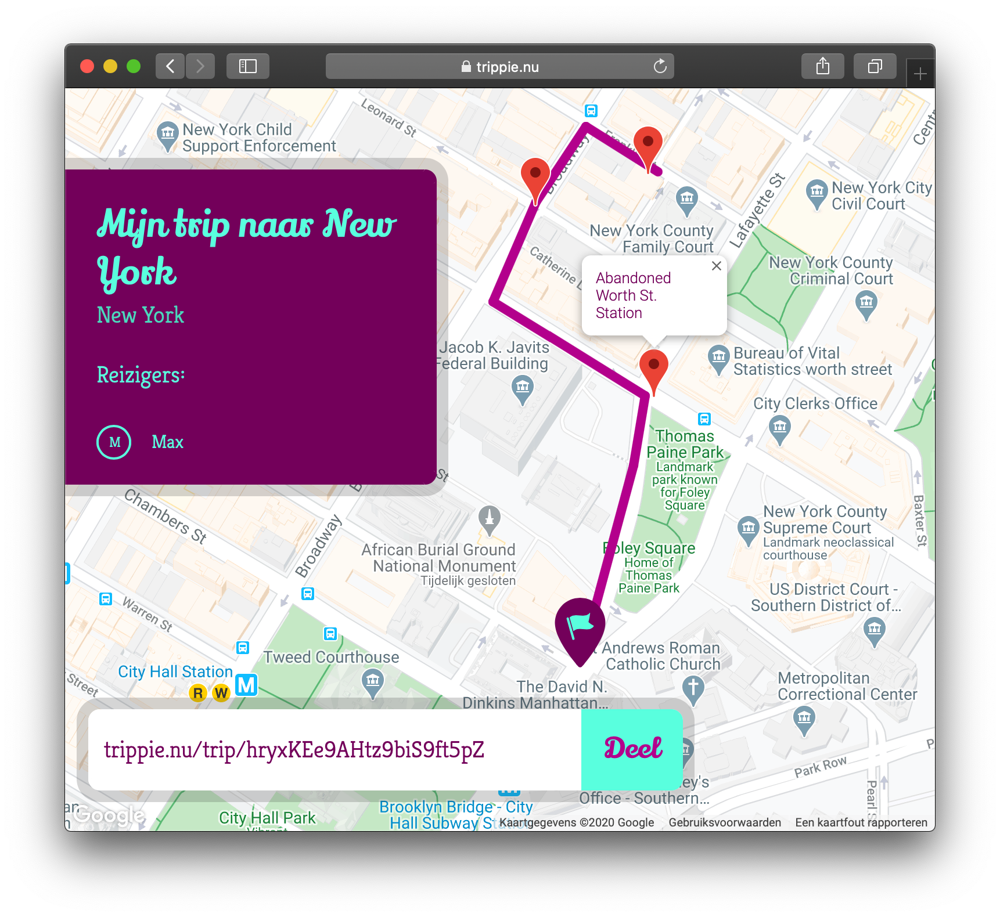
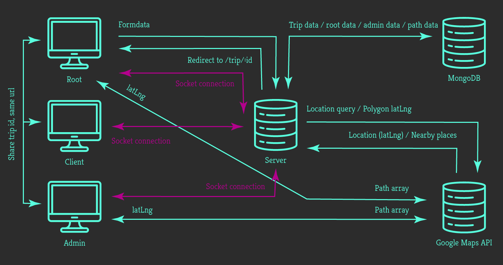
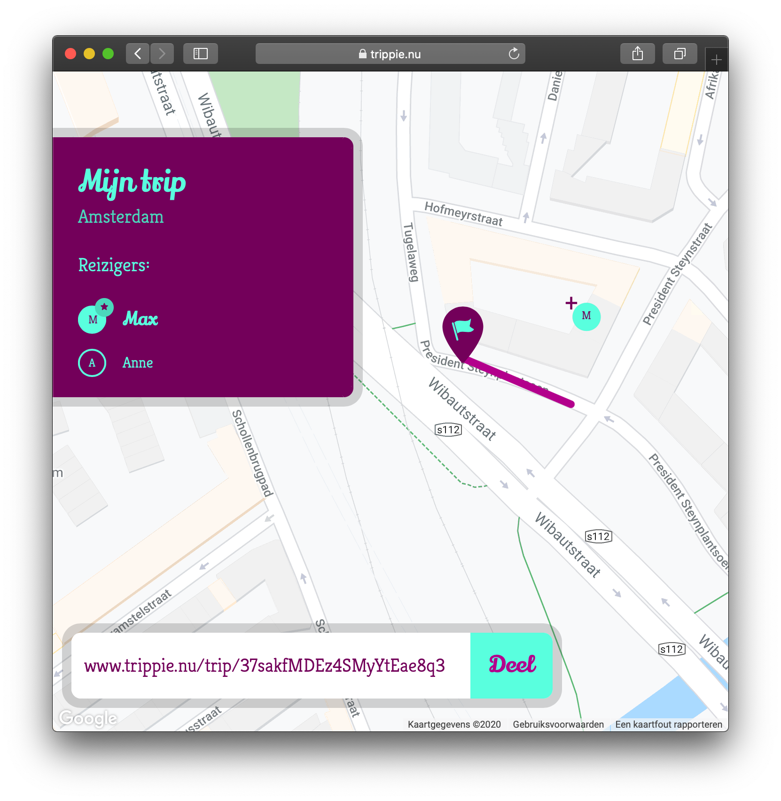
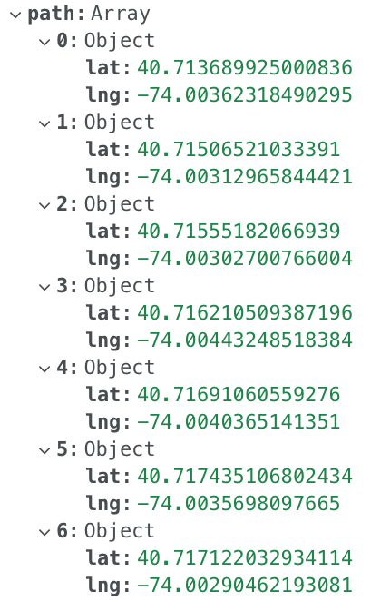
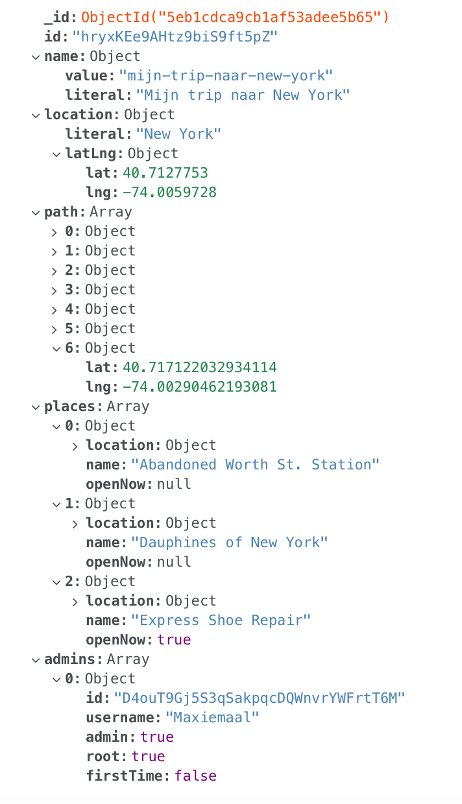

#  Trippie
**Plan samen je trip**


---

## Table of contents

* [Concept](#concept)
* [Framework and Packages](#frameworks-and-packages)
* [How to install](#how-to-install)
* [Getting started](#getting-started)
* [Data Life Cycle](#data-life-cycle)
* [Socket.io](#socketio)
* [Google Maps API](#google-maps-api)
* [MongoDB](#mongodb)
* [Features](#features)
* [Wishlist](#wishlist)

---

## Concept

You want to plan a cycling trip for next weekend? Want to go on a roadtrip in the summer? Or just be able to plan a nice walk around your neighborhood? Then **Trippie** is the App for you!

With **Trippie** you can create your own trip together with someone else in real-time. Using Google Maps you're able to build a route, piece by piece, for a trip you desire to take later on in real life.

Trippie can show you some nice places close to your route in advance, so you know what to look out for. :eyes:

---

## Frameworks and packages

The App uses the following Frameworks and Packages:

* [x] [Express](https://www.npmjs.com/package/express)
* [x] [Express Session](https://www.npmjs.com/package/express-session)
* [x] [Express-Socket.io-Session](https://www.npmjs.com/package/express-socket.io-session)
* [x] [Path](https://www.npmjs.com/package/path)
* [x] [Http](https://www.npmjs.com/package/http)
* [x] [Body-Parser](https://www.npmjs.com/package/body-parser)
* [x] [EJS](https://www.npmjs.com/package/ejs)
* [x] [Node-Sass](https://www.npmjs.com/package/node-sass)
* [x] [Short-UUID](https://www.npmjs.com/package/short-uuid)
* [x] [Socket.io](https://www.npmjs.com/package/socket.io)
* [x] [MongoDB](https://www.npmjs.com/package/mongodb)
* [x] [@Googlemaps/google-maps-services-js](https://www.npmjs.com/package/@googlemaps/google-maps-services-js)

---

_Dont worry about the amount though, you can install them all at once by running `npm install`, as you will find out below_ :arrow_down:

---

## How to install

_Now, let's go dive into the technical bit._ :alien: :computer:

To start, clone this repo: `git clone https://github.com/vriesm060/real-time-web-1920.git`.

Next, navigate to the repo in your terminal and install the dependencies: `npm install`.

The final step is to build the sass files into a single `main.css` file. To do this, run the following command: `npm run build-sass`.

---

## Getting started

Before you run the app, you might want to create your own `.env` file. You can store your port in here, for example `PORT = 3000`. It's not a must, as the server will default to a port, but this way you have more control over it.

Now it's time to run the App: `npm start` and enjoy! :sunglasses:

---

## Data Life Cycle

This next diagram displays how the data travels through the App and connects to the API.



As you can see, we divide the clients into 3 groups:

* **The Root client:** the one who creates the trip. He/she has the rights to edit the route and add or remove clients as Admin. There can only be one Root client.
* **The Admin client:** who has the rights to edit the route. There can be multiple Admin clients at a time.
* **The regular client:** who can only watch other people editing the route. Everyone, except Root, will start out as a regular client.

All three clients are connected to the server via a socket connection and will receive updates in real-time.

The Root and Admin are also connected directly to the Google Maps API. This is because we want to render the map and this can only be done client-side. The clients will interact with the map (e.g. add polylines, edit part of the route) and the Google Maps API will return latLng coordinates, which the client then sends to the server through socket. The server will return this information to all other clients.

### The Server

The server is also connected to the MongoDB database. The server will send and update data to the database whenever a client makes an update on the map.

Later, when another client enters or an existing client refreshes the page, the server will request the data back from the database and serve this to the clients.

The server is also connected to the Google Maps API. It requests a location from the query entered by the client. This is done through Geocoding. It also requests the nearby places for each route segment added by a client.

---

## Socket.io

This App relies on 3 major components, which I would like to address in this readme. [Socket.io](https://socket.io/) is the first one.

Socket.io is a real-time engine which is responsible for the real-time events happening all over the App. From showing all the connected clients to transferring route data between server and clients. Socket.io makes this all possible.

**A great example of this real-time connection:**

_From client [map.js](https://github.com/vriesm060/real-time-web-1920/blob/6e02a52f52c834be8c26a0edafef7140526d73ec/public/js/components/map.js#L49)_
```
google.maps.event.addDomListener(map, 'mousemove', (e) => {
  if (self.admin) {
    var neBoundInPx = self.map.getProjection().fromLatLngToPoint(bounds.ne);
    var swBoundInPx = self.map.getProjection().fromLatLngToPoint(bounds.sw);
    var worldPoint = new google.maps.Point(e.clientX / scale + swBoundInPx.x, e.clientY / scale + neBoundInPx.y);
    var latlng = self.map.getProjection().fromPointToLatLng(worldPoint);
    namespace.emit('cursor move', latlng);
  }
});
```

_To server [app.js](https://github.com/vriesm060/real-time-web-1920/blob/d6eb5d2badb8101bb6f43858be47c3d541fa2678/app.js#L196), and back_
```
socket.on('cursor move', (latlng) => {
  socket.broadcast.emit('change cursor', {
    id: socket.handshake.session.id,
    latlng: latlng
  });
});
```

_To other clients [map.js](https://github.com/vriesm060/real-time-web-1920/blob/6e02a52f52c834be8c26a0edafef7140526d73ec/public/js/components/map.js#L173)_
```
.on('change cursor', (client) => {
  // Calculate point on screen from latLng:
  var neBoundInPx = self.map.getProjection().fromLatLngToPoint(bounds.ne);
  var swBoundInPx = self.map.getProjection().fromLatLngToPoint(bounds.sw);
  var latlng = new google.maps.LatLng(client.latlng);
  var worldPoint = self.map.getProjection().fromLatLngToPoint(latlng);
  var point = new google.maps.Point((worldPoint.x - swBoundInPx.x) * scale, (worldPoint.y - neBoundInPx.y) * scale);
  cursor.changeCursorPosition(client.id, point);
})
```

This connection transforms a client's cursor position on the screen to `latLng` (latitude/longitude) coordinates on the map, `var latlng = self.map.getProjection().fromPointToLatLng(worldPoint);`, and passes it along to the server.

The server then passes this `latLng` back to the other clients, including the id of the cursor's socket. (So we know who it is)

On these clients the `latLng` gets transformed back into a point on the screen (x,y).

_Real-time cursor in action:_


---

## Google Maps API

The App uses the Google Maps API as its data source. Using this API users can interact with the world map, drawing route segments onto it resulting in a route. This can all be done in real-time with other users.

**Users can:**

* Add a start marker to determine the start point of the route
* Add route segments (polylines), connected to one another
* Edit individual polyline points, thus reshaping the polylines
* Move the start marker
* Delete polylines

All of this can be done in real-time and updates made will be served to all clients simultaneously, as well as the database. So when you refresh the page, the updates are still in place.

### How it works

Each edit that is made adds, removes or changes a `latLng` coordinate in a path array. This path array lives on the server and in the database. From there it gets served back to the clients.

**Example of path array on the server:**
```
var cachePaths = [
  {
    namespace: namespace,
    latLngs: [
      { lat: 40.713689925000836, lng: -74.00362318490295 },
      { lat: 40.71506521033391, lng: -74.00312965844421 },
      { lat: 40.71555182066939, lng: -74.00302700766004 },
      { lat: 40.716210509387196, lng: -74.00443248518384 },
      { lat: 40.71691060559276, lng: -74.0040365141351 },
      { lat: 40.717435106802434, lng: -74.0035698097665 },
      { lat: 40.717122032934114, lng: -74.00290462193081 },
    ]
  }
];
```

**Example of path array in the database:**
<br>

**This results in:**


_When an admin clicks anywhere on the map ([map.js](https://github.com/vriesm060/real-time-web-1920/blob/6e02a52f52c834be8c26a0edafef7140526d73ec/public/js/components/map.js#L70))_
```
google.maps.event.addListener(self.map, 'click', (e) => {
  if (self.admin) namespace.emit('edit route', e.latLng);
});
```

_The corresponding `latLng` gets emitted to the server ([app.js](https://github.com/vriesm060/real-time-web-1920/blob/d6eb5d2badb8101bb6f43858be47c3d541fa2678/app.js#L212))_

```
socket.on('edit route', (latLng) => {
  // Push coords to the cache data and serve this back to the clients:
  namespacePath.latLngs.push(latLng);
  io.of(namespace).emit('add route segment', namespacePath.latLngs);

  // Update database:
  db.collection('trips').updateOne(
    { id: trip.id },
    { $push: {'path': latLng} }
  );
});
```

_The `latLng` is pushed in a path array on the server, for instant access and pushed in a path array on the database, for when a client refreshes the page._

_This path gets served back to the clients and transformed into either a `startMarker` (first time) or `polyline`. ([map.js](https://github.com/vriesm060/real-time-web-1920/blob/6e02a52f52c834be8c26a0edafef7140526d73ec/public/js/components/map.js#L77))_

```
if (self.path.indexOf(latLng) == 0) {
  self.startMarker = new google.maps.Marker({
    position: latLng,
    map: self.map,
    draggable: self.admin ? true : false,
    icon: {
      url: '/images/icons/start_point.svg',
      scaledSize: new google.maps.Size(60,60),
      anchor: new google.maps.Point(30,55)
    }
  });
} else if (self.path.indexOf(latLng) > 0) {
  var polyline = new google.maps.Polyline({
    path: self.path.slice(self.path.indexOf(latLng)-1, self.path.indexOf(latLng)+1),
    map: self.map,
    geodesic: true,
    editable: self.admin ? true : false,
    strokeColor: '#B3008C',
    strokeOpacity: 1,
    strokeWeight: 8
  });
}
```

### Places API

The App makes use of the Google Maps Places API, which gives us the opportunity to find places (hotels, restaurants, companies, etc.) nearby a given location. In our case, the location is the latest segment added to the route by a client.

Each time someone adds a route segment, we activate the Places API and find nearby places, which we will add to the map in the form of a marker. The information about a place is always up-to-date.

**The request from the server to the API ([app.js](https://github.com/vriesm060/real-time-web-1920/blob/9b204c7aadf769c1573f738aa5dc67a712c3eba2/app.js#L258))**
```
maps
  .placesNearby({
    params: {
      key: process.env.GOOGLE_MAPS_API_KEY,
      location: data.latLng,
      language: 'nl',
      radius: 10
    }
  })
  .then(result => {
    if (result.data.status === Status.OK) {
      // Focus on businesses only:
      var places = result.data.results.filter(data => data.business_status);

      // Map the data we want:
      places = places.map(place => {
        return {
          location: place.geometry.location,
          name: place.name,
          openNow: place.opening_hours ? place.opening_hours.open_now : undefined
        }
      });
```

---

## MongoDB

The App uses [MongoDB](https://www.mongodb.com/) as its database. Here we store all the created trips and the associated data in a collection called **trips**.

Each trip is an BSON object which looks like the following:<br>
_[app.js](https://github.com/vriesm060/real-time-web-1920/blob/d6eb5d2badb8101bb6f43858be47c3d541fa2678/app.js#L43)_
```
var trip = {
  id: uuid.generate(),
  name: {
    value: req.body.trip.replace(/\s+/g, '-').replace('/', '-').toLowerCase(),
    literal: req.body.trip
  },
  location: {
    literal: data.address_components[0].long_name,
    latLng: data.geometry.location
  },
  path: [],
  places: [],
  admins: [
    {
      id: req.body.socketId,
      username: req.body.username,
      admin: true,
      root: true,
      firstTime: true,
    }
  ]
};
```

In the database it looks like this:
<br>

The `id` is a random generated uuid. The trip `name` and `location` are from the form you need to fill in at the beginning. The `path` array will be updated with `latLng` coordinates as the route is being build.

Last but not least we define an `admins` array where we store the first admin, the client that created the trip, and give him/her both admin and root rights.

* **Admin rights** give clients the rights to edit the route on the map
* **Root rights** give clients the same rights as admin, as well as the rights to add or remove an admin. Root rights are given solely to the client who created the trip.
* **Regular clients** are only allowed to watch

### Server and database in action

The following shows some database actions performed from the server.

**Connecting to the database ([app.js](https://github.com/vriesm060/real-time-web-1920/blob/d6eb5d2badb8101bb6f43858be47c3d541fa2678/app.js#L85)):**
```
client.connect(err => {
  if (err) throw err;
  var db = client.db('trippie');

  db.collection('trips').findOne({ id: req.params.id }, (err, result) => {
    if (err) throw err;
    var trip = result;
  });
}
```

**Adding an admin ([app.js](https://github.com/vriesm060/real-time-web-1920/blob/d6eb5d2badb8101bb6f43858be47c3d541fa2678/app.js#L168)):**
```
db.collection('trips').updateOne(
  { id: trip.id },
  { $push: { 'admins': {
    id: curUser.id,
    username: curUser.username,
    admin: curUser.admin,
    root: curUser.root
  } } }
);
```

**Removing an admin ([app.js](https://github.com/vriesm060/real-time-web-1920/blob/d6eb5d2badb8101bb6f43858be47c3d541fa2678/app.js#L189)):**
```
db.collection('trips').updateOne(
  { id: trip.id },
  { $pull: { 'admins': { id: curUser.id } } }
);
```

**Add a route segment ([app.js](https://github.com/vriesm060/real-time-web-1920/blob/d6eb5d2badb8101bb6f43858be47c3d541fa2678/app.js#L219)):**
```
db.collection('trips').updateOne(
  { id: trip.id },
  { $push: {'path': latLng} }
);
```

**Edit a polyline ([app.js](https://github.com/vriesm060/real-time-web-1920/blob/d6eb5d2badb8101bb6f43858be47c3d541fa2678/app.js#L251)):**
```
db.collection('trips').updateOne(
  { id: trip.id },
  { $push: { 'path': {
    $each: [data.newLatLng],
    $position: data.idx
  } } }
);
```

**Delete a polyline ([app.js](https://github.com/vriesm060/real-time-web-1920/blob/d6eb5d2badb8101bb6f43858be47c3d541fa2678/app.js#L279)):**
```
db.collection('trips').updateOne(
  { id: trip.id },
  { $pull: { 'path': {
    $in: data.latLngs.splice(1, data.latLngs.length-1)
  } } }
);
```

---

## Features

The major features in a nutshell:

* [x] :round_pushpin: Create a trip to a given location
* [x] :floppy_disk: Your hard work gets saved when you want to return later
* [x] :wrench: Building a route together in real-time
* [x] :arrow_upper_left: Showing others where your cursor is located on Google Maps, using the latitude and longitude coordinates, in real-time
* [x] :dancers: Sharing a trip with everyone you want
* [x] :information_desk_person: Separating Admin users who are able to edit the route and regular users who can only watch
* [x] :heavy_plus_sign: :heavy_minus_sign: The option to add or remove other Admins
* [x] :house: Real-time place information for places close to your route

---

### License :unlock:
MIT &copy; Max de Vries
